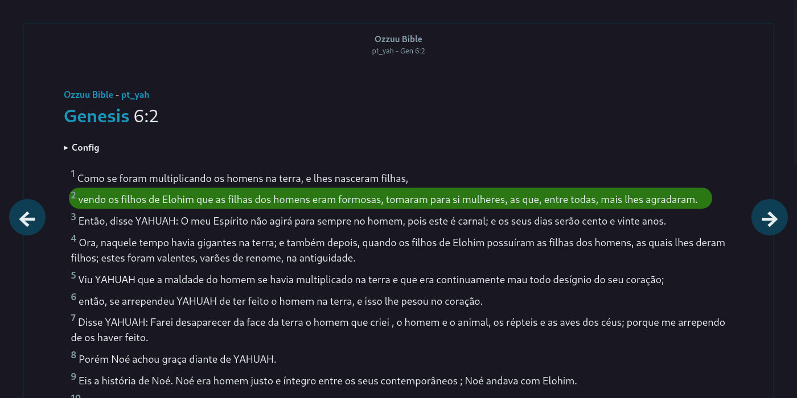
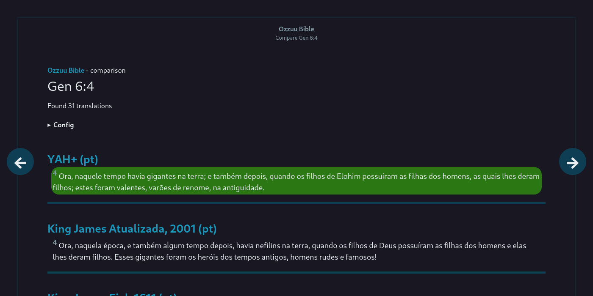

# **Ozzuu Bible**

#### 
Finally a online bible that respects your privacy!

**[About](#about)** - [License](#license)

_Documents page_

---

_Books page_

---

_Chapters page_

---

_Verses page_

---

_Compare page_

---

_Search page_

## About

Ozzuu Bible is online MyBible document reader

## TODO

- [ ] Use just lowercase book names
- [ ] Add support to import bibles from other sources
- [ ] Add document info at doc selection
- [ ] The go back/next verse needs to change book too
- [ ] If is there just the go to next chapter button, move it to right
- [x] Add a command to clean access count DB
- [ ] Merge Info table with Document table
- [ ] Show full book name at title
- [ ] Fix search highlight by replacing with a case insensitive function
- [ ] Add a dashboard to see the most accessed books, verses and some cool verses
- [ ] At search page, show: "Found 40 matches, showing 20-30" instead of "Found 40 results, showing page 2"
- [ ] Add the commentaries
  - [ ] Add DB
  - [ ] Add importation
  - [ ] Add to view (optionally hidden)
- [x] Allow compare same books with different names like: Gen and Gn
- [ ] Add custom styling for printing
- [ ] Improve readme

## License

This software is FOSS, licensed over GPL-3.
